# Database
সহজ ভাষায় বলতে গেলে ডাটাবেস হচ্ছে বেসিক্যালি একটি সফটওয়্যার যেটার মাধ্যমে ডাটা সেভ করে রাখতে পারবো এবং সেই ডাটা গুলোর মধ্যে সহজে খোজাখুজি, মোডিফাই, ডিলেট এইসব কাজ করতে পারবো আর এইসব কাজ করাটা আমাদের জন্য খুবই সহজ বানিয়ে দিবে ডাটাবেস সফটওয়্যার। ডাটাবেস বললেই অনেকেই বুঝে MySQL, MongoDB আর সবকিছুর কথা ভুলে যাই, আসলে ব্যাপারটা কিন্তু তা না যখন আমরা ডেটাবেসের কথা বলবো তখন নানা রকমের ডাটাবেস আছে ওয়ার্ল্ডে সবারই কিছু না কিছু সুবিধা অসুবিধা রয়েছে। ডাটাবেসের মধ্যে আবার মেজর ২টি টাইপ আছেঃ
* RDBMS (Relational Database Management System) এখানে ডাটাগুলোর মধ্যে বিভিন্ন ধরনের রিলেশন রাখা যাই এই ডাটাটা ওই ডাটার সাথে রিলেটেড বা অনেক গুলো ডাটা ওই একটা ডাটার সাথে রিলেটেড এই ধরনের ভার্চুয়াল রিলেশন এস্টাবলিশ করা যাই।
* Non-RDBMS (Non Relational Database Management System) এই Non-RDBMS এর মধ্যে ইম্পরট্যান্ট একটি টাইপ হচ্ছে No-SQL.

Non-RDBMS ব্যাবহার হয় যে আমাদের কিছু ডাটা স্টোর করার দরকার সেগুলো রিপ্রীভ করা দরকার সেখানেও যে কোন ভাবে রিলেশন করা যাবে না তা না ম্যানুয়ালি আলাদা ভাবে এস্টাবলিশ করা লাগবে এই ডাটাবেস গুলো বিগ ডাটার জন্য খুব সহজ যেমন No-SQL. SQL হচ্ছে বেসিক্যালি Structured Query Language এটা হচ্ছে ডাটাবেসের মধ্যে ডাটা অ্যাড করা, খোজ, আপডেট মোডিফাই, ডিলিট এই গুলো করার জন্য এক ধরণের ল্যাঙ্গুয়েজ। প্রত্যেকটি ডেটাবেজ সফটওয়্যার কোন না কোনো ভাবে বেসিক SQL ঠিক রেখে তারমধ্যে আরো ছোট-খাটো এক্সট্রা অ্যাডভান্টেজ ফীচার অ্যাড করে তো বেসিক SQL কম্যান্ড-গুলো বেসিক্যালি সব ডাটাবেস সফটওয়্যারে রান করে এরপরে আবার ডাটাবেস সফটওয়্যার স্পেসিফিক কিছু কম্যান্ড আছে যেগুলো শুধু মাত্র পার্টিকুলার সফটওয়্যারে চলে, যেমন ধরেন Oracle, SQL Server, MySQL, MariaDB, PostgreSQL হয়তো দেখা যাবে বেসিক এসকিউএল গুলো সবগুলাই চলছে কিন্তু কিছু কিছু পার্টিকুলার এসকিউএল যেটা oracle জন্য তৈরি ওটা postgresql, mysql চলছে না ব্যাপারটা এইরকম। আমরা সামনে MySQL, MariaDB দেখবো দুইটাই একদমই সিমিলার। 

তো আমরা ইচ্ছা করলে Oracle, SQL Server, MySQL, MariaDB, PostgreSQL এইগুলো আলাদা আলাদা ভাবে নামিয়ে লোকাল মেশিনে ব্যাবহার করতে পারি বা ওয়েব সার্ভার সল্যুশন স্ট্যাক ভিত্তিক প্যাকেজগুলো যেমন: 
XAMPP, AMPPS, MAMP, WAMP ব্যাবহার করতে পারেন বেশ ঝামেলা মুক্ত। আমি XAMPP, AMPPS ব্যাবহার করে থাকি।

যদি MySQL, MariaDB সাথে কানেক্ট করতে চাই তাহলে ৪টা প্যারামিটার লাগবে সার্ভারের নাম, ইউজারের নাম, পাসওয়ার্ড ও ডেটাবেসের নাম। সাধারণত লোকাল মেশিনে সার্ভারের নাম হয় __localhost অথবা 127.0.0.1__ এছাড়া রিমোট হোস্টিং সার্ভারের যদি হোস্ট করা থাকে তাহলে তখন সেটার আইপি এড্রেস সার্ভারের নাম হিসাবে ব্যবহার করা হয়। ডিফল্ট ইউজার নাম থাকে __root__. ডিফল্ট পাসওয়ার্ড থাকে, এটা আপনার ইনস্টলের উপর ডিপেন্ড করছে AMPPS থাকে __mysql__ XAMPP এ কোন পাসওয়ার্ড নাই আর ডেটাবেসের নাম হল ক্রিয়েট করলেন বা যে ডাটাবেসে টেবিলগুলো বানিয়ে ডাটা রাখবেন। আমারা চাইলে কিন্তু কোড এডিটর থেকে বিভিন্ন এক্সটেনশনের মাধ্যমে ডাটাবেসের সাথে কানেক্ট করতে পারি __VS__ কোডে করার জন্য এই [লিঙ্কের](https://youtu.be/C0y35FpiLRA) ভিডিওটি দেখুন আর PHPStorm এ এই ফিচারটি দেওয়াই থাকে।

ডাটাবেস তৈরি করার জন্য new তে গিয়ে Database Name এবং Collation থেকে utf8_general_ci বা utf8mb4_general_ci সিলেক্ট করে দিব তাহলে সব ধরণের ল্যাংগুয়েজ সাপোর্ট করবে। তারপর ক্রিয়েট বাটনে ক্লিক করলেই ডাটাবেজ তৈরী হয়ে যাবে

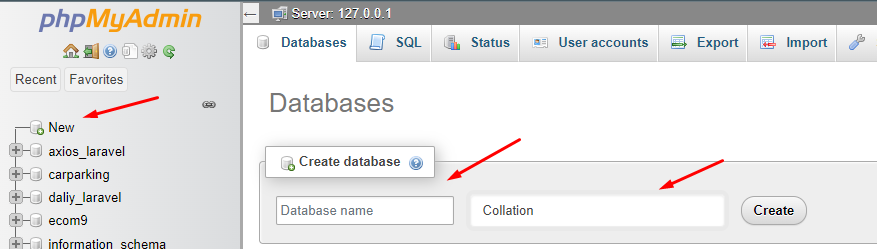

তো এখন আমাদের ডাটাবেস তৈরি হয়ে গেলো এখন আমাদের টেবিল তৈরি করতে হবে।

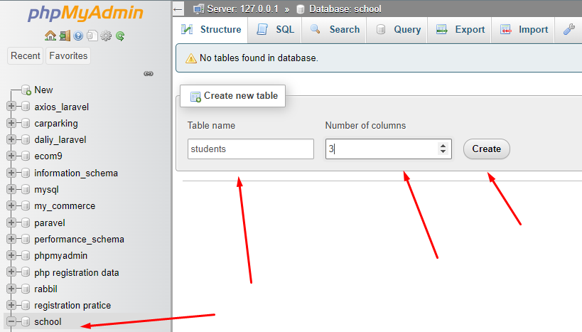
আমারা টেবিলের নাম দিলাম স্টুডেন্ট এবং ৩টি কলাম নিলাম ক্রিয়েট করার পর কলামগুলোর নাম, টাইপ, লেংথ দিয়ে দিবো
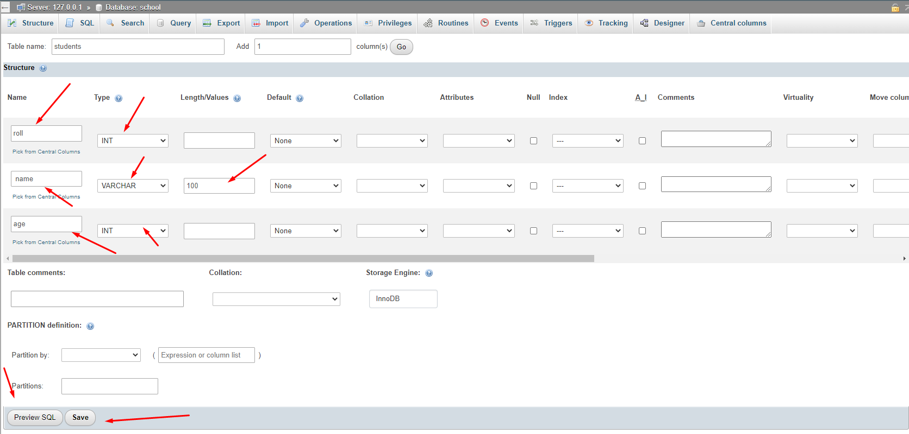
আমরা তো ভিজ্যুয়াল ভাবে টেবিলটি ক্রিয়েট করলাম ফিলড নাম দিলাম কিন্তু তলায় তলায় বা নিচে নিচে কিন্তু এসকিউএল চলছে কি এসকিউএল চলছে তা দেখার জন্য __Preview SQL__ ক্লিক করলে দেখতে পারবো যেমনঃ

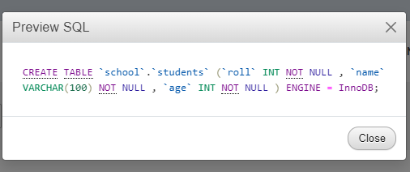

এখন আমারা যদি ডাটা ভিজ্যুয়াল ভাবে ডাটা ইনসার্ট করতে চাই তাহলেঃ

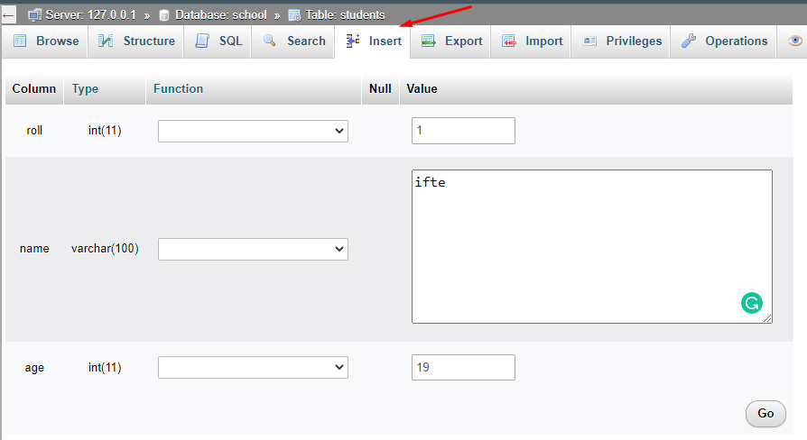
আমাদের টেবিল এখন যেমন দেখাবেঃ

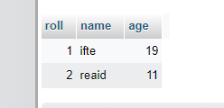

চলুন ডেটাবেজের কিছু বেসিক SQL কমান্ডের সাথে পরিচয় হয়ে নেই কারন আমরা ডাটা দিয়ে যতই কাজ করি না কেন সবগুলোই ডাটাবেসের কাছে SQL কমান্ড হিসেবে পাঠাতে হয় সে তখন তা রান করে আমাদেরকে ফলাফলটি দিয়ে থাকে তো SQL কমান্ডের টি দুইটি টাইপ আছে একটি হচ্ছে __DDL – Data Definition Language__ আরেকটি হচ্ছে __DML – Data Manipulation Language__. DDL হচ্ছে যেটা দিয়ে টেবিল তৈরি করতে হয় বিভিন্ন জিনিস ম্যানেজ করতে হয় এগুলো আর DML হচ্ছে যেটা দিয়ে আমারা রেকর্ড তৈরি, এডিট, ডিলিট করতে পারি তো আমারা এখন দেখবো DML পথমে আমরা দেখবো কি ভাবে একটি টেবিল থেকে সবগুলো রেকর্ড দেখতে পারি এটার জন্য আমাদের দরকার হবে একটি টেবিলের নাম এবং কমান্ডটি হবেঃ
```SQL
    SELECT * FROM students;
```
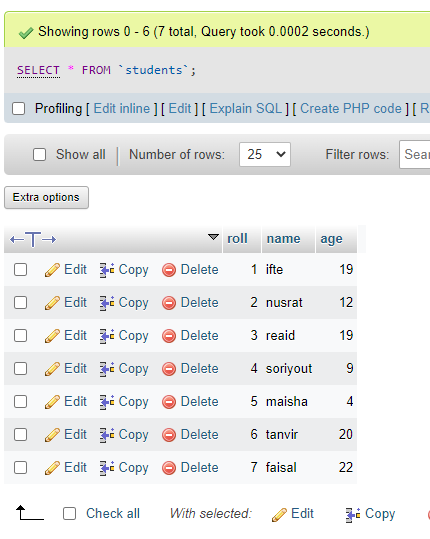

SELECT * মানে টেবিলের সব ফিল্ডের সব কলামগুলো, মানে সব ডাটা ১ লাখ  ডাটা থাকলে ওই ১ লাখ ডাটাই আনবে।

আমারা যদি শুধু name এবং age ফিল্ড দেখতে চাই এবং আগে age পরে name দেখতে চাই তাহলে কমান্ডটি হবেঃ
```sql
    SELECT age, name FROM `students`;
```
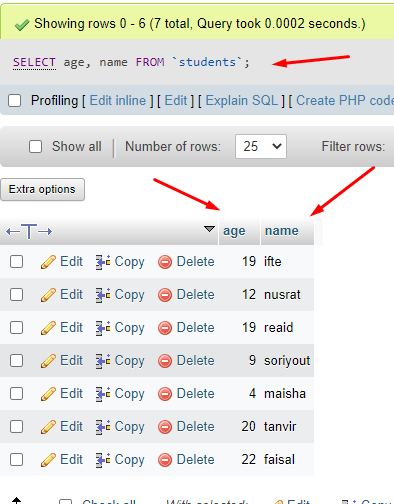

যদি সব ফিল্ডের পথম দিকের মানে এক হাজার ডাটার মধ্যে প্রথম চারটা দেখতে চাই তাহলে টেবিলের নাম এর পর __LIMIT__ লেখে কতগুলো কলাম দেখতে চাই তা দিবো যেমনঃ
```SQL
    SELECT * FROM students LIMIT 4;
```
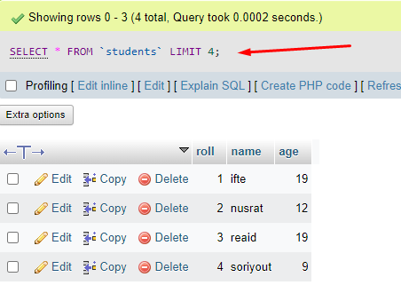

আমরা যদি চাই Ascending Descending অর্ডারে দেখাতে তাও পারবো যেমনঃ বয়স উপর বেস করে ছোট থেকে বড় দেখাতে চাই মানে Ascending অর্ডারে

```SQL
    SELECT * FROM `students` ORDER BY age;
    -- SELECT * FROM `students` ORDER BY age ASC;
```
ডিফল্ট ভাবে অর্ডার Ascending ভাবে থাকে তাই দিলেও হবে না দিলেও হবে
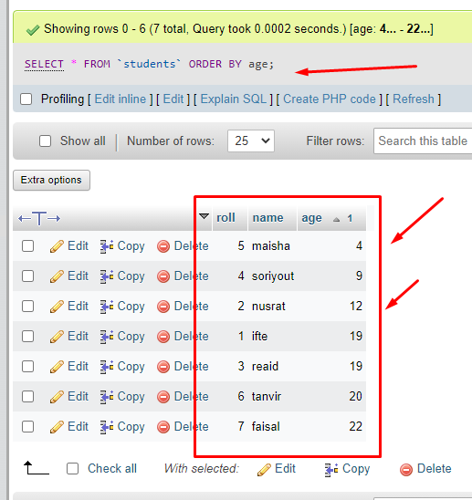

Descending অর্ডারে বা বড় থেকে ছোট অনুসারে দেখতে চাই তাহলেঃ
```SQL
    SELECT * FROM `students` ORDER BY age DESC;
```

SQL টি নিজে চালিয়ে দেখুন।

আমরা যদি নির্দিষ্ট কিছু খুঁজতে চাই তাহলে আমরা কন্ডিশন ব্যবহার করতে পারি। ধরেন আমরা ১৯ বছরের মানুষদের বের করতে চাই তাহলেঃ
```SQL
    SELECT * FROM students WHERE age = 19;
```
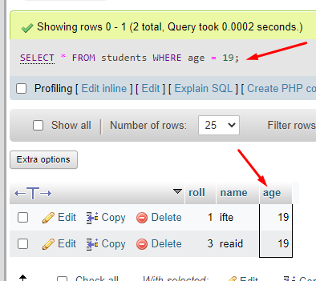

এখন যদি কার নাম ধরে খুজতাম তাহলে কন্ডিশনটি হতোঃ
```SQL
    SELECT * FROM students WHERE name = "ifte";
```
SQL টি নিজে চালিয়ে দেখুন। বিষয়টি বুজতে পড়েছেন, যেকোনো ফিল্ড এবং তার ভ্যালু উপর বেস করে আমরা কন্ডিশন দিয়ে নির্দিষ্ট ডাটা গুলো আনতে পারি।

আমরা তো ডাটা কিভাবে দেখবো তা শিখলাম কিন্তু এই ডাটা-গুলো তো আগে অ্যাড বা ইন্সার্ট করা লাগবে। তো চলুন অ্যাড বা ইন্সার্ট করার জন্য কি রকম এসকিউএল কম্যান্ড ব্যবহার করতে হয় চলুন দেখিঃ
```SQL
    INSERT INTO `students`(`roll`, `name`, `age`) VALUES ('8','Badhon','18');
```
যদি আমরা ফিল্ড বা কলামের সাথে একই সিকোয়েন্স রাখি তাহলে কলাম নামগুলো না দিলেও হবে যেমনঃ
```SQL
    INSERT INTO `students` VALUES ('8','Badhon','18');
```
কিন্তু আবার যদি আমরা নাম আগে এবং রোল এইজ পরে মানে সিকোয়েন্স অনুজাই অনুযায়ী না তাহলে কিন্তু আমাদের কলামের নামগুলো ভ্যালু অনুযায়ী সাজিয়ে দিতে হবে যেমনঃ
```SQL
    INSERT INTO `students` (`name`, `roll`, `age`) VALUES ('Badhon','8','18');
```
এসকিউএল কমান্ড গুলো নিজে চালিয়ে দেখুন। ইন্সার্ট এসকিউএল কমান্ড গুলো আশা করি বুজতে পড়েছেন।

এখন মনে করেন আমাদের একটি নামে ভুল হয়েছে তাহলে আমাদের এডিট করতে হবে মানে আপডেট কমান্ড ব্যাবহার করতে হবে চলুন এসকিউএল কমান্ডটি দেখিঃ
```SQL
    UPDATE `students` SET `name`="MD. Ifte" WHERE `roll`=1;
    -- যদি মাল্টিপল কলাম আপডেট করতে চাই তাহলেঃ
    UPDATE `students` SET `name`="MD. Ifte", `roll`="10", `age`="22" WHERE `roll`=1;
```
এসকিউএল কমান্ড গুলো নিজে চালিয়ে দেখুন। যদি আমরা কন্ডিশন না দিতাম তাহলে সবার ভ্যালু গুলো একই হয়ে যেত কারণ সবার জন্য এটা ট্রু কারণ কন্ডিশন দিয়ে ডিফাইন করে দেয়া হয়নি যে কার জন্য বরাদ্ধ এটি। এই জন্যই আপডেট কুয়েরি চালানোর সময় সব সময় WHERE ব্যাবহার করতে হয়।

এখন কাওকে যদি ডিলিট করতে চাই তাহলেঃ
```SQL
    DELETE FROM `students` WHERE `roll`=3;
```
যদি আমরা WHERE না দিতাম মানে শুধু `DELETE FROM students` তাহলে কিন্তু সব ডাটা ডিলিট হয়ে যেত।

তো Insert Update Select Delete এই চারটাই হচ্ছে মূল কুয়েরি এই গুলো নিয়ে আরও গভীর কিছু সামনে শিখবো ইনশাআল্লাহ।